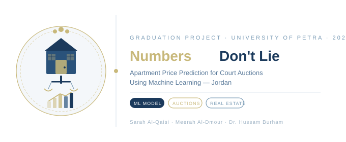

    

---

# Numbers Don't Lie
### Replacing Traditional Appraisers with Predictive Machine Learning for Mortgaged Properties

> Every year, Jordanian courts rely on human appraisers to value mortgaged apartments before auction.
> Two appraisers. Same apartment. A difference of 50,000 JOD.
> This project fixes that.

---

## Authors

| Name | Student Number |
|------|---------------|
| Sarah Al-Qaisi | 202210717 |
| Meerah Al-Dmour | 202210974 |

**Supervised by:** Dr. Hussam Barham
**Course:** 307498 – Graduation Project
**Semester:** Second Semester, 2025/2026
**University of Petra — Business Intelligence**

---

## Table of Contents

| # | Section | Link |
|---|---------|------|
| 1 | Abstract & Acknowledgment | [View](docs/00_abstract.md) |
| 2 | Project Description & Objectives | [View](docs/01_project_description.md) |
| 3 | Data Research & Acquisition | [View](docs/02_data_research.md) |
| 4 | Data Description & Understanding | [View](docs/03_data_analysis.md) |
| 5 | Dashboard Design & Business Insights | [View](docs/04_dashboard_design.md) |
| 6 | Advanced Analytics & AI Modeling | [View](docs/05_advanced_analytics.md) |
| 7 | Deployment & Tools | [View](docs/06_deployment.md) |
| 8 | Results & References | [View](docs/07_results.md) |
| 9 | Notebook | [View](notebooks/apartment_price_prediction.ipynb) |
| 10 | Dashboard | [View](dashboards/) |

---

## What We Built

A machine learning model trained on **603 real apartment transactions** across **8 Jordanian cities**. Given any apartment's documented features — size, location, floor, age, amenities — the model predicts its fair market price **in milliseconds**.

**No site visit. No subjectivity. No inconsistency.**

The best model, Gradient Boosting, explains **72.5% of the variance** in apartment prices with an average error of **15,193 JOD** — comparable to the gap between two independent human appraisers.

---

## Key Results

| Model | MAE (JOD) | RMSE (JOD) | R² |
|-------|-----------|------------|-----|
| Linear Regression | 21,129 | 34,391 | 0.499 |
| Ridge Regression | 20,748 | 33,334 | 0.529 |
| Lasso Regression | 20,791 | 33,736 | 0.518 |
| Decision Tree | 20,586 | 37,739 | 0.397 |
| Random Forest | 17,198 | 28,779 | 0.649 |
| **Gradient Boosting** ✅ | **15,193** | **25,472** | **0.725** |

---

## What Drives Apartment Prices in Jordan?

| Factor | Importance |
|--------|-----------|
| Apartment Size (m²) | 58.45% |
| Location / Neighborhood | 16.03% |
| Building Age | 5.37% |
| Furnishing Level | 3.77% |
| City | 3.31% |

---

## Dataset

| Property | Value |
|----------|-------|
| Total records | 603 apartments |
| Cities | Amman, Zarqa, Irbid, Madaba, Aqaba, Karak, Salt, Ajloun |
| Neighborhoods | 91 unique locations |
| Features | 22 original + 4 engineered |
| Price range | 9,975 — 359,800 JOD |
| Median price | 84,975 JOD |
| Sources | Company X, OpenSooq, Facebook, Court Auctions |

---

## How the Model Works

```python
# Load the saved model
model   = joblib.load('models/best_model.pkl')
le_city = joblib.load('models/le_city.pkl')
le_loc  = joblib.load('models/le_loc.pkl')

# Predict price for a new apartment
predict_price(
    city             = 'Amman',
    location         = 'Abdoun',
    size             = 200,
    bedrooms         = 3,
    building_age     = 3,
    floor_num        = 2,
    balcony          = 1,
    furnished        = 0,
)
# Output → Predicted Price: 178,800 JOD | 894 JOD/m²
```

---

## Project Structure

| Folder/File | Contents |
|-------------|----------|
| `docs/` | Full project documentation (00–07) |
| `data/raw/` | Original Excel dataset |
| `data/processed/` | Cleaned data for Tableau |
| `notebooks/` | Main Python notebook |
| `dashboards/` | Tableau workbook |
| `models/` | Saved ML models (.pkl) |
| `assets/` | Images, logos, charts |
| `requirements.txt` | Python dependencies |

---

## How to Run

```bash
# 1. Clone the repository
git clone https://github.com/sarahqaisi26/apartment-price-prediction

# 2. Install dependencies
pip install -r requirements.txt

# 3. Open Google Colab
# https://colab.research.google.com

# 4. Run all cells from top to bottom
```

> Data loads automatically from GitHub — no manual upload needed.

See [docs/06_deployment.md](docs/06_deployment.md) for full setup instructions.

---

## Dashboard

View the interactive Tableau dashboard:
[View on Tableau Public](https://public.tableau.com)

Includes 11 visualizations covering:
- Price distribution across 8 cities
- Actual vs Predicted prices
- Top 10 locations by price
- Building age vs price
- Furnished vs Unfurnished comparison

---

## Tools Used

| Purpose | Tool | Why |
|---------|------|-----|
| Data Analysis & ML | Python (pandas, scikit-learn) | Broad ML ecosystem |
| Visualization | Matplotlib, Seaborn | Integrated with pandas |
| BI Dashboard | Tableau Public | Free, professional, widely used in Jordan |
| Development | Google Colab | No installation required |
| Version Control | GitHub | Full documentation and reproducibility |
| Model Saving | joblib | Optimized for scikit-learn |

---

## Real Data Sources

This project used real court auction data from Jordan's Ministry of Justice:


---

## Cross-Validation Results

| Fold | R² Score |
|------|---------|
| Fold 1 | 0.7224 |
| Fold 2 | 0.7632 |
| Fold 3 | 0.5876 |
| Fold 4 | 0.5371 |
| Fold 5 | 0.6257 |
| **Average** | **0.6472** |

---

*Built with real data. Documented with care. Numbers Don't Lie.*
